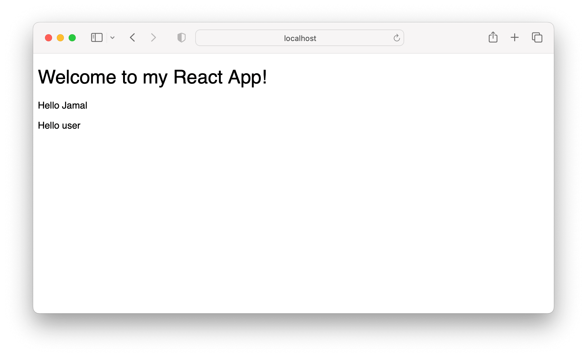

# Props

In Visual Studio code, press `command+shift+v` (Mac) or `ctrl+shift+v` (Windows) to open a Markdown preview.

## Getting Started

Using your command line, you will need to navigate to the this folder, install all dependencies, and start the app.

```bash
cd exercises/03-props/
code . # if you would like to open this in a separate VSCode window
npm install
npm start
```

To stop the application, press `ctrl+c`.

To run the tests:

```shell
npm run test
```

If you do not see any test results, press `a` to run all tests. The tests will rerun whenever you make a change.

To stop the tests, press `ctrl+c`.

## Assignment 1

Create a component called `<Welcome />`. It should receive the prop "name". If "name" is provided, you will render "Hello **\_\_\_\_\_**". If the name is not provided, you will fallback to "Hello user".

Import and your render you `<Welcome />` component in `<App />` like this:

```jsx
<Welcome name="Jamal" />
<Welcome />
```



### Acceptance Criteria

- I should create a component called `<Welcome />` that should render test to the screen.
- It should receive the prop "name".
- It should use default props.
- If "name" is provided, you will render "Hello **\_\_\_\_\_**". If the name is not provided, you will fallback to "Hello user".

## Assignment 2

Create a component called `<Heading />`. This component should render any children props to the screen.

Import and your render you `<Heading />` component in `<App />` like this:

```jsx
<Heading>Welcome to my React App!</Heading>
```

### Acceptance Criteria

- I should create a component called `<Heading />` that renders children props to the screen.
- The `<App />` component should use the `<Heading />` component to render the text "Welcome to my React App!" to the screen.
